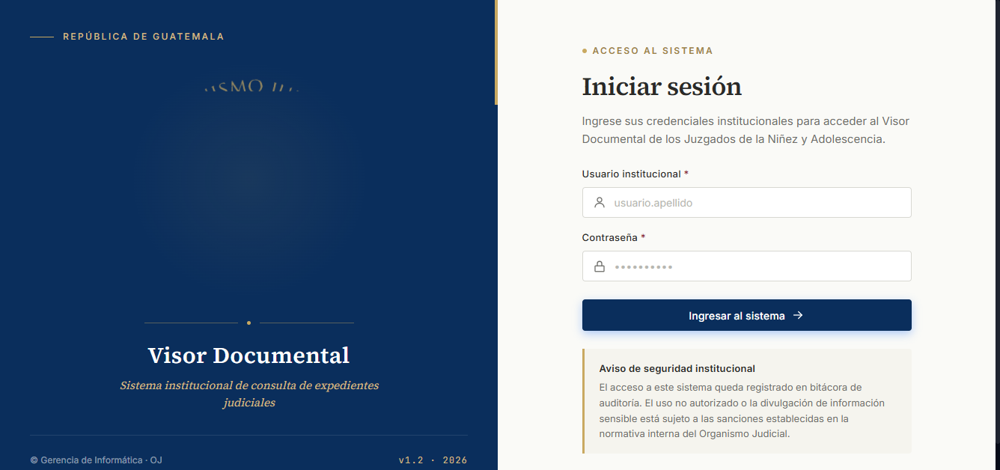

# Capitulo 2 — Acceso y navegacion

## Objetivo de este capitulo

Al terminar de leer este capitulo usted sabra:
- Como ingresar al sistema con sus credenciales.
- Que sucede si ingresa su contrasena incorrectamente varias veces.
- Como orientarse dentro del sistema: menu lateral y barra superior.
- Como cambiar su contrasena.
- Como cerrar sesion de forma segura.

---

## 2.1 Como ingresar al sistema (Login)

1. Abra su navegador (Chrome, Firefox, Edge o Safari).
2. Escriba en la barra de direccion la URL del sistema que le proporcionaron desde su area de informatica.

3. En la pantalla de acceso, escriba su **nombre de usuario** en el primer campo.
4. Escriba su **contrasena** en el segundo campo.
5. Haga clic en el boton **Ingresar**.
6. Si sus credenciales son correctas, el sistema lo llevara directamente al panel de busqueda principal.

> [!WARNING]
> **Bloqueo de cuenta por intentos fallidos:** Si ingresa su contrasena incorrectamente **5 veces seguidas**, su cuenta quedara bloqueada automaticamente por medidas de seguridad. Cuando esto ocurre, el sistema mostrara un mensaje de cuenta bloqueada y usted no podra intentar ingresar nuevamente. Debera contactar al administrador del sistema o a su supervisor para que desbloqueen su cuenta.

> [!TIP]
> Si olvido su contrasena, no intente adivinarla repetidamente. Contacte directamente al administrador del sistema para solicitar un restablecimiento de contrasena. De esta forma evita el bloqueo de su cuenta.

---

## 2.2 Duracion de la sesion

> [!NOTE]
> Su sesion en el SGED tiene una duracion maxima de **8 horas continuas** desde el momento en que inicio sesion. Pasado ese tiempo, el sistema cerrara su sesion automaticamente por seguridad y le pedira que vuelva a ingresar sus credenciales. Guarde su trabajo con frecuencia si trabaja sesiones largas.

Si en algun momento ve la pantalla de inicio de sesion cuando estaba trabajando, es probable que su sesion haya expirado. Ingrese sus credenciales nuevamente para continuar.

---

## 2.3 Descripcion del menu lateral

Una vez dentro del sistema, el lado izquierdo de la pantalla muestra la **barra de navegacion lateral**. Esta barra contiene los accesos directos a los modulos del sistema y permanece visible en todo momento.

Los elementos del menu lateral son:

| Elemento del menu | Descripcion |
|-------------------|-------------|
| **Busqueda de expedientes** | Pantalla principal para consultar expedientes por numero o nomenclatura |
| **Expedientes** | Acceso al listado y gestion de expedientes |
| **Reportes** | Generacion de reportes del sistema |
| **Usuarios y roles** | Administracion de cuentas de usuario (solo ADMINISTRADOR) |
| **Auditoria** | Registro de actividad del sistema (solo ADMINISTRADOR) |
| **Dashboard** | Panel con indicadores generales de expedientes |

> [!NOTE]
> El menu lateral solo muestra las opciones para las cuales su rol tiene permiso. Si no ve alguna opcion, es porque no esta habilitada para su nivel de acceso. Esto es un comportamiento normal del sistema.

En la parte **inferior del menu lateral** encontrara siempre visible un panel con su informacion personal: su avatar con iniciales, su nombre completo y su rol en el sistema. Desde ahi tambien puede cerrar sesion (ver seccion 2.6).

---

## 2.4 Descripcion de la barra superior

La **barra superior** se encuentra en la parte alta de la pantalla y permanece visible durante la navegacion. Su diseno es minimalista y contiene:

- **Titulo de la seccion actual** (izquierda o centro): indica en que modulo se encuentra.
- **Ruta de navegacion (migas de pan)**: muestra la ubicacion dentro del sistema, por ejemplo: *Consulta / Busqueda de expedientes*.

> [!NOTE]
> La barra superior es **unicamente informativa**. No contiene menus desplegables, botones de perfil ni opciones de configuracion. Todas las acciones de sesion (cambiar contrasena, cerrar sesion) se realizan desde el **menu lateral izquierdo**, no desde la barra superior.

---

## 2.5 Como cambiar su contrasena

Es recomendable cambiar su contrasena periodicamente. Para hacerlo:

1. En el **menu lateral izquierdo**, haga clic en el icono de **Configuracion** (representado por un engranaje ⚙).
2. El sistema lo llevara a la pantalla de cambio de contrasena.
3. Complete los tres campos del formulario:
   - **Contrasena actual:** escriba su contrasena vigente.
   - **Nueva contrasena:** escriba la contrasena que desea usar.
   - **Confirmar nueva contrasena:** escriba nuevamente la nueva contrasena para verificarla.
4. Haga clic en el boton **Guardar** o **Actualizar**.
5. El sistema confirmara el cambio con un mensaje de exito. A partir de ese momento debera usar la nueva contrasena en sus proximos ingresos.

> [!WARNING]
> No comparta su contrasena con otras personas. Cada usuario debe ingresar con sus propias credenciales. Las acciones realizadas en el sistema quedan registradas bajo el usuario que las ejecuto.

> [!TIP]
> Elija una contrasena que combine letras, numeros y caracteres especiales, y que tenga al menos 8 caracteres. Evite usar fechas de nacimiento o nombres propios faciles de adivinar.

---

## 2.6 Como cerrar sesion

Cuando termine su jornada de trabajo o vaya a alejarse de su computadora por un tiempo prolongado, cierre sesion para proteger la informacion:

1. Dirijase al **panel de usuario** ubicado en la parte **inferior izquierda del menu lateral**. Ahi vera su avatar, nombre y rol.
2. Haga clic en el **icono de salida** (flecha apuntando hacia la derecha, al lado de su nombre).
3. El sistema le pedira confirmacion con un mensaje: *"¿Esta seguro de que desea cerrar sesion?"*.
4. Haga clic en **Cerrar Sesion** para confirmar.
5. El sistema lo redirigira a la pantalla de inicio de sesion.

> [!WARNING]
> No cierre simplemente la pestana del navegador sin cerrar sesion primero, especialmente si trabaja en un equipo compartido. La sesion permanece activa hasta que la cierre manualmente o transcurran las 8 horas automaticas.

---

## Permisos de acceso por rol

| Accion | ADMIN | SECRETARIO | AUXILIAR | JUEZ | CONSULTA |
|--------|:-----:|:----------:|:--------:|:----:|:--------:|
| Iniciar sesion | Si | Si | Si | Si | Si |
| Cambiar contrasena propia | Si | Si | Si | Si | Si |
| Cerrar sesion | Si | Si | Si | Si | Si |
| Ver todas las opciones del menu | Si | No | No | No | No |

---

*Capitulo anterior: [Introduccion al sistema](01-introduccion.md)*
*Siguiente capitulo: [Gestion de expedientes](03-expedientes.md)*
