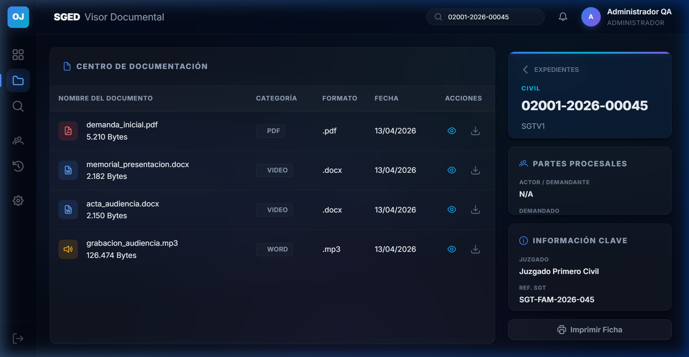
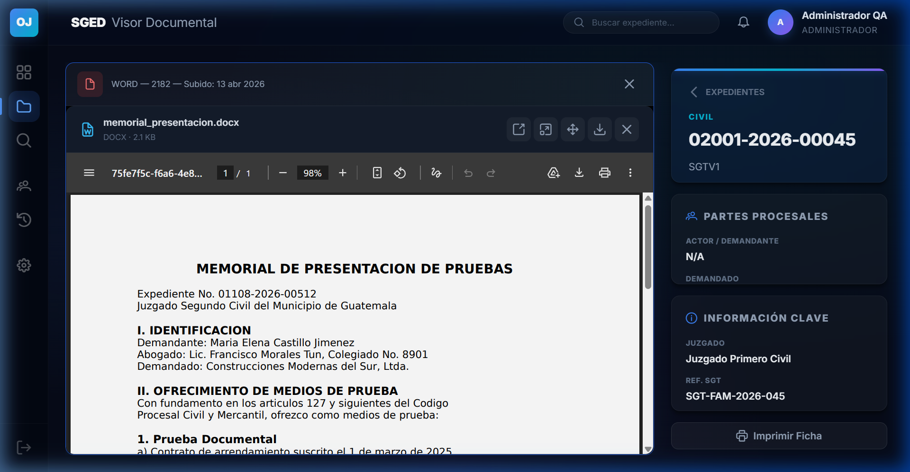
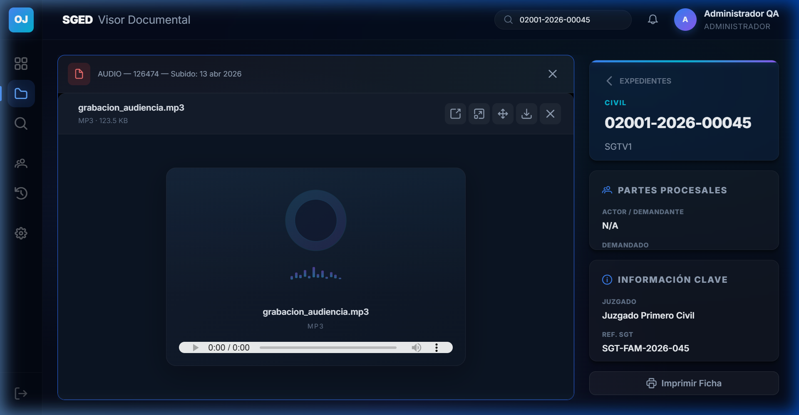
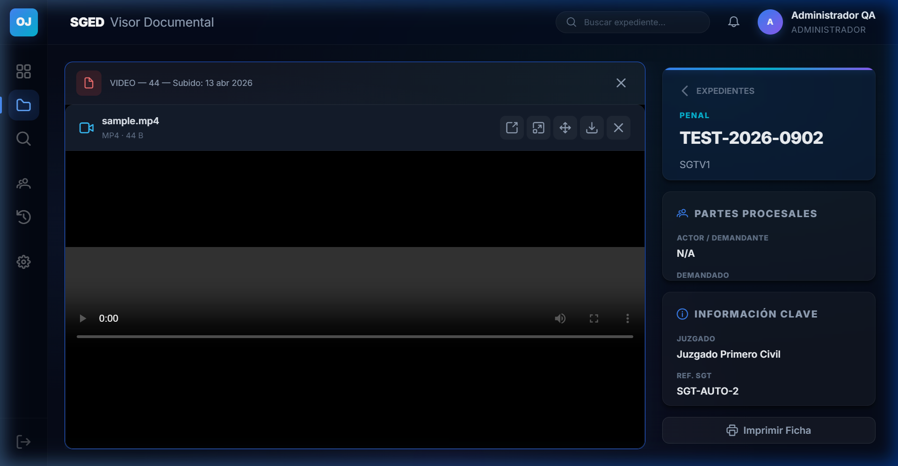

# Capitulo 4 — Gestion de documentos

## Objetivo de este capitulo

Al terminar de leer este capitulo usted sabra:
- Como acceder a los documentos de un expediente.
- Que tipos de archivo acepta el sistema y cual es el tamanio maximo permitido.
- Como subir un nuevo documento.
- Como usar el visor integrado para ver documentos en pantalla.
- Como utilizar el "Modo Presentación" para consolidar e imprimir los documentos.
- Como eliminar un documento y las consecuencias de esta accion.

---

## 4.1 Acceder a los documentos de un expediente

Los documentos siempre estan asociados a un expediente. Para acceder a ellos:

1. Vaya al modulo de **Expedientes** desde el menu lateral.
2. En el listado, localice el expediente cuyos documentos desea consultar.
3. Haga clic en el icono de **Documentos** o **Boveda** (representado por una carpeta de archivos o un archivador) en la fila del expediente.



4. El sistema abrira la lista de documentos adjuntos a ese expediente.

Alternativamente, puede acceder a los documentos desde la pantalla de detalle del expediente, donde aparece una seccion o pestana de documentos.

---

## 4.2 Formatos y tamanio maximo de archivos

El sistema acepta los siguientes tipos de archivo:

| Tipo de archivo | Extensiones aceptadas |
|-----------------|-----------------------|
| Documentos PDF | .pdf |
| Documentos de texto | .docx (Microsoft Word) |
| Hojas de calculo | .xlsx (Microsoft Excel) |
| Imagenes | .jpg, .jpeg, .png |
| Video | .mp4 |
| Audio | .mp3, .wav |

> [!WARNING]
> **Tamanio maximo por archivo: 100 MB.** Si intenta subir un archivo que supera este limite, el sistema lo rechazara y mostrara un mensaje de error. En ese caso, reduzca el tamanio del archivo antes de intentar subirlo nuevamente.

> [!NOTE]
> No se aceptan otros formatos fuera de los listados arriba. Si necesita subir un tipo de archivo diferente, consulte con el administrador del sistema para evaluar si puede habilitarse.

---

## 4.3 Subir un nuevo documento

> [!NOTE]
> Solo los usuarios con rol **ADMIN**, **SECRETARIO** o **AUXILIAR** pueden subir documentos.

Para agregar un nuevo documento a un expediente:

1. Acceda a la seccion de documentos del expediente (ver punto 4.1).
2. Haga clic en el boton **Subir documento** (ubicado generalmente en la esquina superior derecha de la seccion de documentos).
3. Tiene dos formas de seleccionar el archivo:
   - **Usando el explorador de archivos:** haga clic en el area de carga y navegue en su computadora hasta encontrar el archivo que desea subir. Seleccionelo y haga clic en Abrir.
   - **Arrastrando y soltando:** arrastre el archivo desde su computadora directamente sobre el area de carga que aparece en pantalla y sueltelo ahi.
4. El sistema verificara que el archivo tenga un formato permitido y que su tamanio no supere los 100 MB.
5. Si el archivo es valido, aparecera una barra de progreso indicando que se esta cargando.
6. Una vez completada la carga, el documento aparecera en la lista del expediente.

> [!TIP]
> Antes de subir un documento, verifique que el archivo esta completo y no esta danado en su computadora. Abra el archivo localmente para confirmarlo antes de cargarlo al sistema.

---

## 4.4 Visor integrado de documentos

El sistema cuenta con un **visor integrado** que le permite ver el contenido de los documentos directamente en pantalla, sin necesidad de descargarlos a su computadora.

Para usar el visor:

1. En la lista de documentos del expediente, localice el documento que desea ver.
2. Haga clic en el icono de **Ver** (representado por un ojo) en la fila del documento.
3. El sistema abrira el visor en pantalla completa o en una ventana superpuesta sobre el contenido.

El visor funciona de forma diferente segun el tipo de archivo:

- **📄 Documentos PDF y Office:** Visualización nativa de alta velocidad. Los documentos de Word se previsualizan automáticamente.

````carousel

<!-- slide -->

````

- **🔊 Audio y Video:** Reproducción multimedia integrada sin salir de la plataforma.

````carousel

<!-- slide -->

````

| Tipo de archivo | Experiencia en el visor |
|-----------------|------------------------|
| **PDF** | Se muestra directamente en pantalla con posibilidad de desplazarse por todas las paginas. |
| **Imagenes (JPG, PNG)** | Se muestra la imagen en alta resolucion, con opcion de zoom. |
| **Audio (MP3, WAV)** | Se muestra un reproductor de audio integrado. Haga clic en el boton de reproducir para escuchar. |
| **Video (MP4)** | Se muestra un reproductor de video integrado. Haga clic en el boton de reproducir para ver el video. |
| **Word (.docx) y Excel (.xlsx)** | El sistema puede mostrar una previsualizacion o convertir el archivo para su visualizacion. |

> [!TIP]
> Si el documento se ve muy pequenio en el visor, use los controles de zoom disponibles en la interfaz del visor. Para la mayoria de documentos PDF, tambien puede usar las teclas `Ctrl +` (aumentar) y `Ctrl -` (reducir) del teclado.

Para cerrar el visor y volver a la lista de documentos, haga clic en el boton de cierre (X) o en cualquier area fuera del visor.

---

## 4.5 Modo Presentación (Impresión y consolidación)

> [!WARNING]
> **Política de No Descarga (DLP):** Por motivos de seguridad y confidencialidad, el sistema **no permite la descarga individual** de documentos sueltos, y bloquea activamente los menús contextuales (clic derecho) e impresión de pantalla.

Para extraer información del sistema o llevar el caso a una audiencia, se utiliza el **Modo Presentación**:

1. En la pantalla principal del expediente, haga clic en el botón **Presentar anclados**.
2. El sistema abrirá una pantalla especial de consolidación.
3. En el panel izquierdo ("Sidebar"), verá todos los documentos PDF compatibles. Puede **arrastrar y soltar** (Drag & Drop) los elementos de la lista para **reordenar** la secuencia como desee.
4. En el panel principal derecho, se mostrarán todas las páginas de los documentos seleccionados fluyendo de manera continua.
5. Presione el botón **Imprimir todo (Ctrl+P)** en la barra superior. El sistema compilará todos los documentos en el orden establecido en un solo archivo PDF nativo para impresión.

---

## 4.6 Eliminar un documento

> [!WARNING]
> **La eliminacion de documentos es una accion permanente.** Una vez eliminado un documento, no puede recuperarse desde la interfaz del sistema. Solo realice esta accion si esta completamente seguro de que el documento debe ser removido.

> [!NOTE]
> Solo los usuarios con rol **ADMIN** o **SECRETARIO** pueden eliminar documentos. Los usuarios con rol AUXILIAR o CONSULTA no tienen acceso a esta accion.

Para eliminar un documento:

1. En la lista de documentos del expediente, pase el cursor sobre la fila del documento que desea eliminar.
2. Haga clic en el icono de **Eliminar** (representado por un bote de basura, que se ilumina al pasar el cursor sobre la fila).
3. El sistema mostrara una ventana de confirmacion preguntando si esta seguro de eliminar el documento.
4. Haga clic en **Confirmar** o **Eliminar** para proceder.
5. Si hace clic en **Cancelar**, la operacion se detiene y el documento permanece en el sistema.
6. Una vez confirmado, el documento desaparecera de la lista.

> [!TIP]
> Antes de eliminar, verifique que el documento no sea necesario para el caso. Si tiene dudas, consulte con su supervisor antes de proceder.

---

## Permisos del modulo de documentos

| Accion | ADMIN | SECRETARIO | AUXILIAR | JUEZ | CONSULTA |
|--------|:-----:|:----------:|:--------:|:----:|:--------:|
| Ver lista de documentos de un expediente | Si | Si | Si | Si | Si |
| Visualizar documentos con el visor | Si | Si | Si | Si | Si |
| Modo Presentación (Imprimir consolidado) | Si | Si | Si | Si | Si |
| Descargar documentos individuales | No | No | No | No | No |
| Subir documentos | Si | Si | Si | No | No |
| Eliminar documentos | Si | Si | No | No | No |

---

*Capitulo anterior: [Gestion de expedientes](03-expedientes.md)*
*Siguiente capitulo: [Busqueda de expedientes](05-busqueda.md)*
