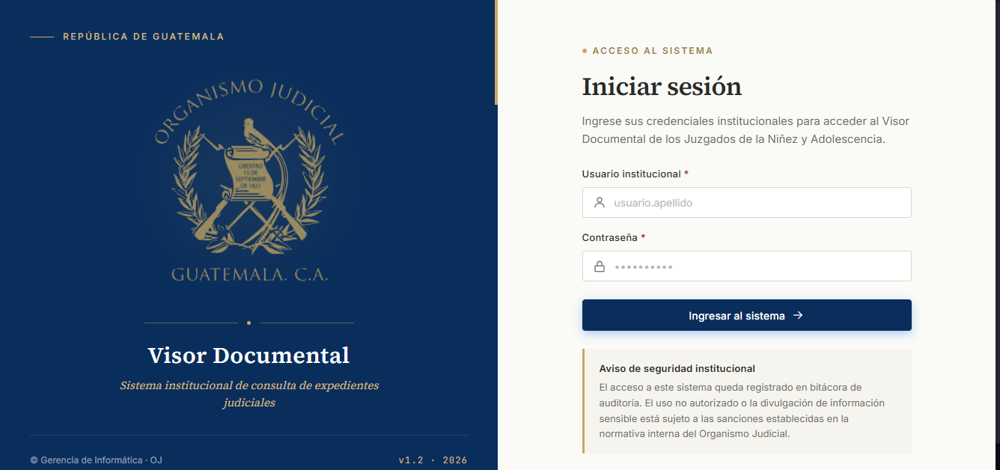

# Capitulo 5 — Busqueda de expedientes

## Objetivo de este capitulo

Al terminar de leer este capitulo usted sabra:
- Como realizar una busqueda por numero o nomenclatura de expediente.
- Como usar los filtros avanzados para refinar resultados.
- Como interpretar las tarjetas de resultado que muestra el sistema.
- Como usar los expedientes anclados para acceso rapido.

---

## 5.1 Tipos de busqueda disponibles

El SGED ofrece dos modalidades de busqueda y una funcion de acceso rapido:

| Modalidad | Cuando usarla |
|-----------|---------------|
| **Expedientes Anclados** | Para acceder instantaneamente a los expedientes que utiliza con mayor frecuencia, fijados en la parte superior de la pantalla. |
| **Busqueda principal** | Cuando conoce el numero exacto o parcial del expediente, o su nomenclatura, y quiere encontrarlo de forma inmediata. |
| **Filtros avanzados** | Cuando necesita refinar los resultados por fecha, expedientes con documentos anclados, expedientes asignados a usted, o audiencias proximas. |

---

## 5.2 Expedientes Anclados (Fijar para acceso rapido)

En la seccion de busqueda, si tiene expedientes anclados, vera tarjetas grandes en la parte superior con la informacion de cada expediente fijado. Cada tarjeta muestra:

- Numero del expediente y juzgado.
- Fecha de preparacion y, si aplica, fecha de audiencia proxima.
- Lista de los primeros documentos anclados.
- Dos botones de accion: **Ver anclados** (abre el expediente en la pestana de archivos) y **Presentar** (inicia el Modo Presentacion).

**Como anclar un documento o expediente:**
1. Cuando visualice un documento dentro de un expediente, busque el icono de **chincheta** (anclar).
2. Haga clic en el para fijar ese documento.
3. Al volver a la pantalla de busqueda, el expediente aparecera en la seccion "Mis anclados".

**Como desanclar:**
Haga clic nuevamente en la chincheta del documento, o utilice el control correspondiente en la tarjeta del expediente anclado.

> [!TIP]
> Los anclados son personales y se guardan en su navegador. Solo usted los ve. Es la forma mas rapida de retomar el trabajo de dias anteriores sin necesidad de buscar nuevamente.

---

## 5.3 Busqueda principal

La busqueda principal es la forma mas directa de encontrar un expediente:

1. En el modulo de **Busqueda de expedientes** (accesible desde el menu lateral), localice el campo de busqueda central en la parte superior de la pantalla.

2. Escriba el numero del expediente o su nomenclatura completa o parcial. Por ejemplo: `01173-2024-00428` o simplemente `2024`.
3. Presione la tecla **Enter** o haga clic en el boton **Buscar**.
4. El sistema mostrara las tarjetas de resultado en la parte inferior de la pantalla.

> [!TIP]
> No necesita escribir el numero completo. Si escribe solo una parte (por ejemplo `2024`), el sistema encontrara todos los expedientes que contengan ese fragmento. El sistema tambien muestra ejemplos de formatos validos debajo del campo de busqueda para orientarlo.

> [!NOTE]
> Para limpiar los resultados y realizar una nueva busqueda, borre el contenido del campo y presione Enter, o simplemente escriba el nuevo termino a buscar.

---

## 5.4 Filtros avanzados

Los filtros avanzados le permiten refinar los resultados de una busqueda ya realizada. Para usarlos:

1. Realice primero una busqueda (ver seccion 5.3).
2. En la barra de resultados que aparece, haga clic en el boton **Filtros avanzados** (icono de embudo, en la esquina derecha de la barra).
3. Se abrira un panel lateral deslizante con los siguientes criterios:

| Filtro | Descripcion |
|--------|-------------|
| **Fecha desde** | Limita los resultados a expedientes creados a partir de esta fecha. |
| **Fecha hasta** | Limita los resultados a expedientes creados hasta esta fecha. |
| **Solo con anclados** | Muestra unicamente expedientes que tengan documentos anclados por usted. |
| **Solo asignados a mi** | Muestra unicamente expedientes asociados a su juzgado o cuenta. |
| **Audiencia proxima** | Muestra unicamente expedientes con una audiencia programada proximamente. |

4. Active los criterios que necesite y haga clic en **Aplicar**.
5. Los filtros activos se mostraran como etiquetas (chips) en la barra de resultados. Puede eliminar cualquier filtro haciendo clic en la X de su etiqueta.

> [!TIP]
> Combine la busqueda por numero con los filtros para afinar aun mas sus resultados. Por ejemplo, busque `2024` y luego active "Solo con anclados" para ver solo los expedientes del 2024 que tiene preparados.

---

## 5.5 Como limpiar los filtros

Para quitar un filtro activo tiene dos opciones:

- Haga clic en la **X** de la etiqueta del filtro que aparece en la barra de resultados.
- Abra nuevamente el panel de filtros avanzados y haga clic en **Limpiar**.

---

## 5.6 Interpretar los resultados de la busqueda

Los resultados se muestran como **tarjetas** en la parte inferior de la pantalla. Cada tarjeta contiene:

| Elemento | Informacion que muestra |
|----------|------------------------|
| **Numero de expediente** | Codigo unico del expediente (en formato destacado) |
| **Juzgado** | Organo judicial donde radica el expediente |
| **Partes del caso** | Nombre del demandante y demandado separados por un punto |
| **Tipo de proceso** | Clasificacion judicial (badge azul) |
| **Estado** | Situacion actual del expediente: Activo, Archivado, Suspendido (badge verde) |
| **Fecha de inicio** | Fecha de apertura del expediente |
| **Indicador de anclados** | Si tiene documentos anclados de ese expediente, aparece un icono de chincheta con el conteo |

Haga clic sobre cualquier tarjeta para ingresar al detalle completo del expediente.

Si la busqueda no encuentra resultados, el sistema mostrara un mensaje indicando que debe ingresar un numero o nomenclatura para comenzar. En ese caso:

- Verifique que no haya errores de escritura en el numero ingresado.
- Pruebe con un fragmento mas corto del numero.
- Si esta seguro de que el expediente existe pero no aparece, contacte al administrador del sistema.

---

## 5.7 Paginacion de resultados

Si la busqueda devuelve muchos resultados, el sistema los muestra en paginas. Al pie de las tarjetas encontrara los controles de paginacion:

- Flechas para avanzar o retroceder de pagina.
- Numeros de pagina para saltar directamente a una pagina especifica.
- Indicador de resultados: *"Mostrando X–Y de Z resultados"*.

> [!TIP]
> Si los resultados son demasiados, active filtros avanzados para reducir la cantidad y encontrar mas rapidamente lo que busca.

---

## Permisos del modulo de busqueda

| Accion | ADMIN | SECRETARIO | AUXILIAR | JUEZ | CONSULTA |
|--------|:-----:|:----------:|:--------:|:----:|:--------:|
| Usar busqueda principal | Si | Si | Si | Si | Si |
| Usar filtros avanzados | Si | Si | Si | Si | Si |
| Ver resultados de busqueda | Si | Si | Si | Si | Si |
| Acceder al detalle de un resultado | Si | Si | Si | Si | Si |
| Usar expedientes anclados | Si | Si | Si | Si | Si |

---

*Capitulo anterior: [Gestion de documentos](04-documentos.md)*
*Siguiente capitulo: [Panel principal (Dashboard)](06-dashboard.md)*
