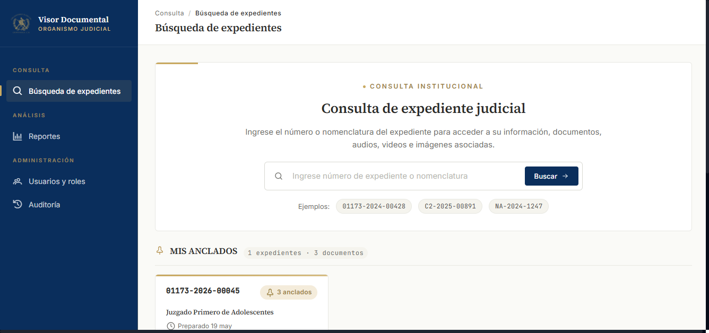

# Capitulo 6 — Panel principal (Dashboard)

## Objetivo de este capitulo

Al terminar de leer este capitulo usted sabra:
- Como acceder al panel principal del sistema.
- Que informacion muestran los indicadores del panel.
- Como interpretar cada contador para tomar decisiones rapidas.
- Como ver la actividad reciente del sistema (solo para administradores).

---

## 6.1 Que es el panel principal

El **panel principal** (tambien llamado Dashboard) es una pantalla que muestra un resumen visual del estado actual de todos los expedientes registrados en el sistema, con indicadores numericos actualizados.

> [!NOTE]
> Al ingresar al sistema, la pantalla que carga primero es la de **Busqueda de expedientes** (no el dashboard). El panel principal es una pantalla separada a la que puede acceder en cualquier momento desde el menu lateral.

El panel muestra:
1. **Cuatro indicadores (KPIs)** con contadores en tiempo real.
2. **Tabla de expedientes recientes** con los ultimos expedientes registrados, con filtros por estado y fechas.
3. **Tabla de actividad reciente** con el registro de acciones del sistema (visible solo para el rol ADMINISTRADOR).

---

## 6.2 Como acceder al panel principal

El panel principal no carga automaticamente al iniciar sesion. Para acceder a el:

1. Haga clic en la opcion **Dashboard** del menu lateral izquierdo.

El panel se actualiza con los datos mas recientes cada vez que lo visita.

---

## 6.3 Indicadores disponibles en el panel

El panel principal muestra cuatro contadores principales:

| Indicador | Descripcion | Para que sirve |
|-----------|-------------|----------------|
| **Expedientes Registrados** | Numero total de expedientes en el sistema, independientemente de su estado. | Conocer el volumen total de la base documental gestionada. |
| **En Proceso (Activos)** | Cantidad de expedientes con estado activo o en tramite. | Identificar cuantos casos estan en tramite actualmente. |
| **Pendientes (En espera)** | Cantidad de expedientes en estado de espera o suspension temporal. | Medir cuantos casos estan detenidos o a la espera de actuacion. |
| **Archivados** | Cantidad de expedientes con estado archivado o cerrado. | Medir el volumen de casos concluidos o resguardados. |

> [!NOTE]
> Los valores de los indicadores reflejan el estado en tiempo real de la base de datos del sistema. Cada vez que se crea un expediente o se cambia su estado, los contadores del panel se actualizan automaticamente.

---

## 6.4 Tabla de expedientes recientes

Debajo de los indicadores, el panel muestra una tabla con los **expedientes mas recientemente registrados** en el sistema. Esta tabla incluye:

- Numero de expediente (con enlace directo al detalle).
- Descripcion o sinopsis del caso.
- Usuario que creo el expediente.
- Fecha y hora de registro.

Puede **filtrar** esta tabla usando los controles ubicados sobre ella:

| Filtro | Descripcion |
|--------|-------------|
| **Estado** | Filtra por: Todos los estados, Activo, En espera, Suspendido, Cerrado, Archivado. |
| **Fecha desde** | Muestra solo expedientes registrados a partir de esta fecha. |
| **Fecha hasta** | Muestra solo expedientes registrados hasta esta fecha. |

Haga clic en cualquier numero de expediente de la tabla para ir directamente a su detalle.

---

## 6.5 Actividad reciente (solo ADMINISTRADOR)

Los usuarios con rol **ADMINISTRADOR** ven adicionalmente una seccion de **Actividad Reciente** al final del panel. Esta seccion muestra un registro de las ultimas acciones realizadas en el sistema, incluyendo:

- Usuario que realizo la accion.
- Tipo de accion (crear, editar, eliminar, etc.).
- Modulo afectado.
- Fecha y hora exacta.
- Direccion IP desde donde se realizo la accion.

> [!NOTE]
> Esta seccion no aparece para los roles SECRETARIO, AUXILIAR, JUEZ y CONSULTA. Es una herramienta exclusiva de administracion y supervision del sistema.

---

## 6.6 Como usar los indicadores para su trabajo diario

Los indicadores del panel le permiten obtener una vision rapida de la situacion sin necesidad de revisar cada expediente individualmente. Algunos ejemplos de uso practico:

- Si el contador de **En Proceso** es muy alto, puede significar que hay muchos casos abiertos que requieren atencion.
- Si el contador de **Pendientes** sube repentinamente, puede indicar que hay casos bloqueados que necesitan seguimiento.
- Comparar el total de expedientes registrados con los activos y archivados le da una idea de la proporcion de casos en curso versus cerrados.

> [!TIP]
> Use el panel como punto de partida al inicio de su jornada laboral para tener una referencia rapida del estado general antes de comenzar a trabajar en expedientes especificos.

---

## Permisos del panel principal

| Accion | ADMIN | SECRETARIO | AUXILIAR | JUEZ | CONSULTA |
|--------|:-----:|:----------:|:--------:|:----:|:--------:|
| Ver el panel principal | Si | Si | Si | Si | Si |
| Ver los cuatro indicadores | Si | Si | Si | Si | Si |
| Ver tabla de expedientes recientes | Si | Si | Si | Si | Si |
| Filtrar la tabla de expedientes | Si | Si | Si | Si | Si |
| Ver la seccion de actividad reciente | Si | No | No | No | No |

---

*Capitulo anterior: [Busqueda de expedientes](05-busqueda.md)*
*Siguiente capitulo: [Preguntas frecuentes y problemas comunes](07-faq-y-problemas-frecuentes.md)*
